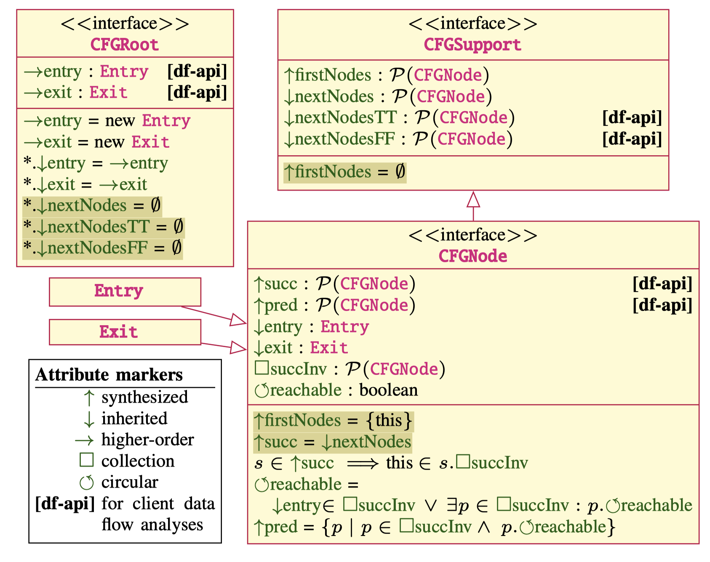
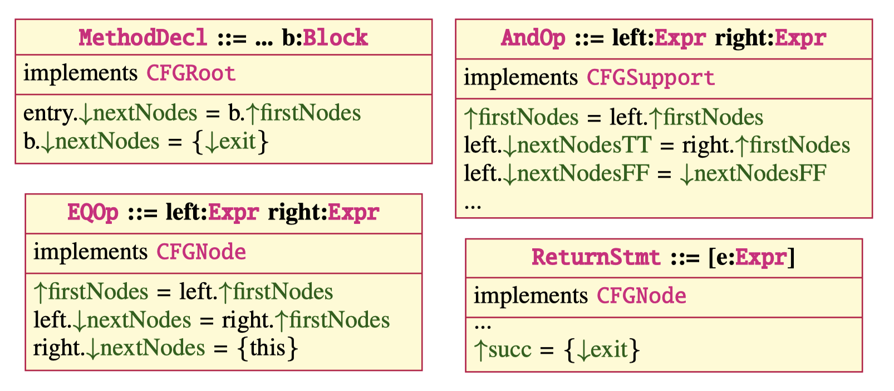

**IntraCFG** is language independent framework for the Java language, written in the [JastAdd](https://jastadd.org) language. More details can be found in the following paper:
* __[A Precise Framework for Source-Level Control-Flow Analysis](https://github.com/lu-cs-sde/IntraJSCAM2021/blob/main/intraj-preprint.pdf)__, _[Idriss Riouak 🔗](https://github.com/IdrissRio), [Christoph Reichenbach 🔗](https://creichen.net), [Görel Hedin 🔗](https://cs.lth.se/gorel-hedin/) and [Niklas Fors 🔗](https://portal.research.lu.se/portal/en/persons/niklas-fors(c1e9efdd-5891-45ec-aa9d-87b8fb7f3dbc).html)_. _[IEEE-SCAM 2021 🔗](http://www.ieee-scam.org/2021/#home)._ 

**IntraCFG** constructs AST-unrestricted control-flow graphs, in that, the resulting CFG need not follow the syntactic nesting structure of the AST.


The **IntraCFG** framework defines three interfaces:
* _CFGRoot_: intended for subroutines, e.g., methods and construcots, to represent a local CFG with a unique entry and exit node.
* _CFGSupport_: used to mark AST nodes in a location that may contain _CFGNodes_. All _CFGNodes_ are _CFGSupport_ nodes, but _CFGSupports_ nodes that are not _CFGNodes_ can help steer the construction of the CFG.
* _CFGNode_: used to mark AST nodes in the CFG. Each node has reference attributes `succ` and `pred` to represent the _successor_ and _predecessor_ edges.

and two synthetic AST types:
* _Entry_: unique entry point of a CFG.
* _Exit_: unique exit point of a CFG.

---

The following is the UML representation of the **IntraCFG** framework. 
`Highlited` attribute equations are default equations, intended for overriding.

<p align="center">
  
</p>

---
## Application of the `**IntraCFG**` framework 
The following figure, shows how the framoework can be specialised to some example AST node types to define the
desired CFG. 

<p align="center">
  
</p>

While the following is the JastAdd translation of `EQOp`:

```
EQOp ::= Left:Expr Right:Expr; // Abstract grammar
EQOp implements CFGNode; 
eq EQOp.firstNodes() = getLeft().firstNodes();
eq EQOp.getLeft().nextNodes() = getRight().firstNodes();
eq EQOp.getRight().nextNodes() = SmallSet<CFGNode>.singleton(this);


```

## **IntraJ**: an application of the **IntraCFG** framework
**[IntraJ](https://github.com/lu-cs-sde/IntraJ)** is an application of the **[IntraCFG](https://github.com/lu-cs-sde/IntraCFG)** framework for the Java language, build as an extension of the **[ExtendJ](https://extendj.org)** Java Compiler.

With **IntraJ** you can:
- construct intra-procedural **Control Flow Graph**,
- (*DAA*) detect **Dead assignments** in your codebase, and
- (*NPA*) detect occurences of **NullPointerException**.


You can run IntraJ on other Java codebases (in Java-4, Java-5, Java-6, and Java-7) in order to construct CFGs and get DAA and NPA analysis results.

